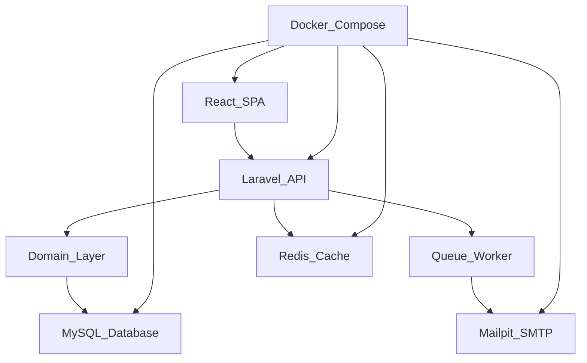

## Stack
- Backend: Laravel 13 (PHP ^8.3), `laravel/sanctum` (SPA auth), `spatie/laravel-permission` (RBAC), `barryvdh/laravel-dompdf`, `laravel/vonage-notification-channel` (from `backend/composer.json`).
- Frontend: React 19 + TypeScript, Vite 8, Tailwind CSS 4, `react-router-dom`, `@tanstack/react-query`, `zustand`, `react-hook-form` + `zod`, `axios` (from `frontend/package.json`).
- Test: Pest / PHPUnit (`backend/tests`, `backend/phpunit.xml`).
- Infra: Docker Compose (`docker-compose.yml`, `docker/php`, `docker/nginx`, `docker/mysql`), per README: nginx, php-fpm, queue worker, scheduler, mysql, redis, mailpit, vite.

## Directory map
| path | what lives there |
|---|---|
| `backend/app/Http` | Controllers/middleware/requests (Laravel HTTP layer) |
| `backend/app/Domain` | Domain logic |
| `backend/app/Models` | Eloquent models |
| `backend/app/Policies` | Authorization policies |
| `backend/app/Providers` | Service providers |
| `backend/app/Console` | Artisan commands |
| `backend/routes` | `web.php`, `api.php`, `console.php` |
| `backend/database` | `migrations`, `seeders`, `factories` |
| `backend/config` | Laravel config (`crm.php`, `sanctum.php`, `auth.php`, etc.) |
| `backend/tests` | `Feature`, `Concurrency`, Pest bootstrap |
| `backend/public` | `index.php` web entry, static assets |
| `backend/resources` | `css`, `js`, `views` |
| `frontend/src/app` | app shell: providers, routing guards, layout |
| `frontend/src/features` | feature modules (auth, products, sales, customers, crm, kpi) |
| `frontend/src/components` | shared UI components |
| `frontend/src/stores` | zustand state stores |
| `frontend/src/lib` | client libs/utilities |
| `frontend/src/types` | TypeScript types |
| `frontend/src/assets` | static assets |
| `docker/php` | PHP-FPM Dockerfile, entrypoint, ini |
| `docker/nginx` | nginx config |
| `docker/mysql` | MySQL init scripts |
| `site` | standalone `index.html` (marketing/landing page) |

## Diagram

## Component index
- [[React_SPA]]
- [[Laravel_API]]
- [[Domain_Layer]]
- [[MySQL_Database]]
- [[Queue_Worker]]
- [[Mailpit_SMTP]]
- [[Redis_Cache]]
- [[Docker_Compose]]

## Entry points
- Frontend dev: `frontend/src/main.tsx` (mounts `App.tsx`), served via `vite` (`frontend/package.json` `"dev": "vite"`).
- Frontend routing root: `frontend/src/App.tsx` (`BrowserRouter` + `Routes`).
- Backend HTTP entry: `backend/public/index.php` (bootstraps `backend/bootstrap/app.php`, handles `Request`).
- Backend CLI entry: `backend/artisan`.
- Composite dev run: `backend/composer.json` `"dev"` script (runs `php artisan serve`, queue listener, `pail`, and `npm run dev` concurrently) — this is backend/frontend Vite (`resources/js`), separate from the top-level `frontend/` app which runs on its own Vite dev server.

## Conventions
- Frontend path alias `@/` used for absolute imports (seen in `App.tsx`: `@/app/providers`, `@/features/...`).
- Frontend feature modules named `<Domain>Page.tsx` under `frontend/src/features/<domain>/` (e.g. `ProductsPage.tsx`, `SaleDetailPage.tsx`, `LostCustomersPage.tsx`).
- Route guarding via wrapper route elements: `ProtectedRoute`, `RoleRoute` (in `frontend/src/app/`) composed around nested `<Route>` blocks in `App.tsx`.
- Backend PSR-4 autoload: `App\` → `app/`, `Database\Factories\` → `database/factories/`, `Database\Seeders\` → `database/seeders/` (from `backend/composer.json` `autoload`).
- Env files are git-ignored; `.env.example` is committed per app (`backend/.env.example`, `frontend/.env.example`) — README step 1 requires copying them before Docker boot.

## Where things go
- To add a new frontend page: add a component under `frontend/src/features/<domain>/`, then register its route in `frontend/src/App.tsx`.
- To add a new API endpoint: add a route in `backend/routes/api.php`, a controller in `backend/app/Http`, and domain logic in `backend/app/Domain`.
- To add a new DB table: add a migration in `backend/database/migrations`, a model in `backend/app/Models`, and (if seeded) a seeder/factory in `backend/database/seeders` / `backend/database/factories`.
- To change authorization rules: add/edit a policy in `backend/app/Policies` (spatie/laravel-permission roles per `backend/config/permission.php`).
- To change infra/services: edit `docker-compose.yml` and the relevant `docker/<service>` directory.
